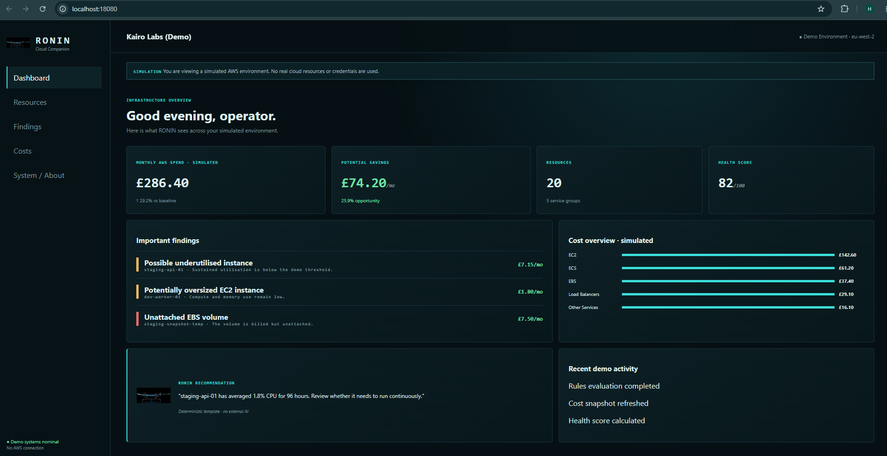
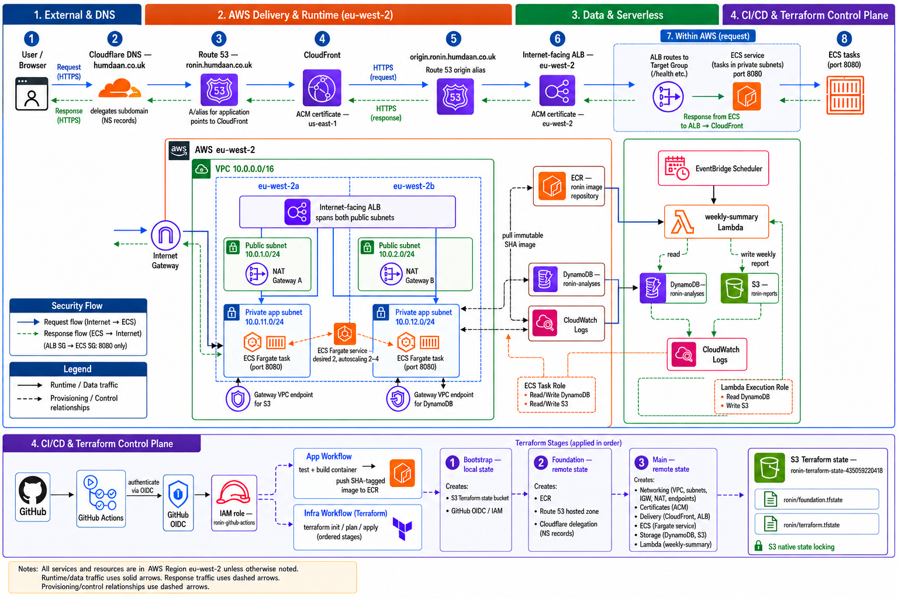
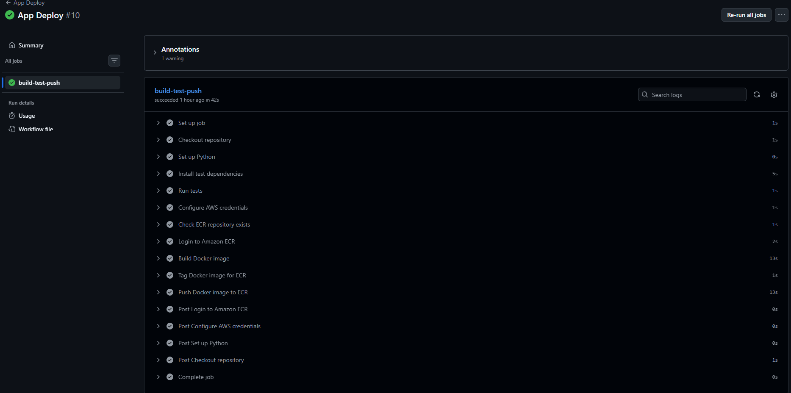
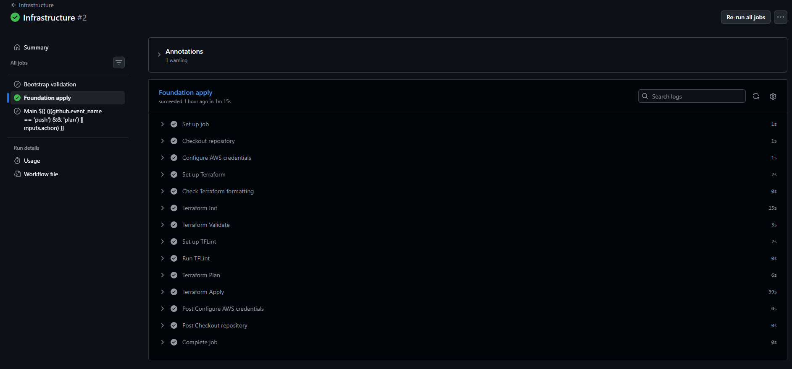
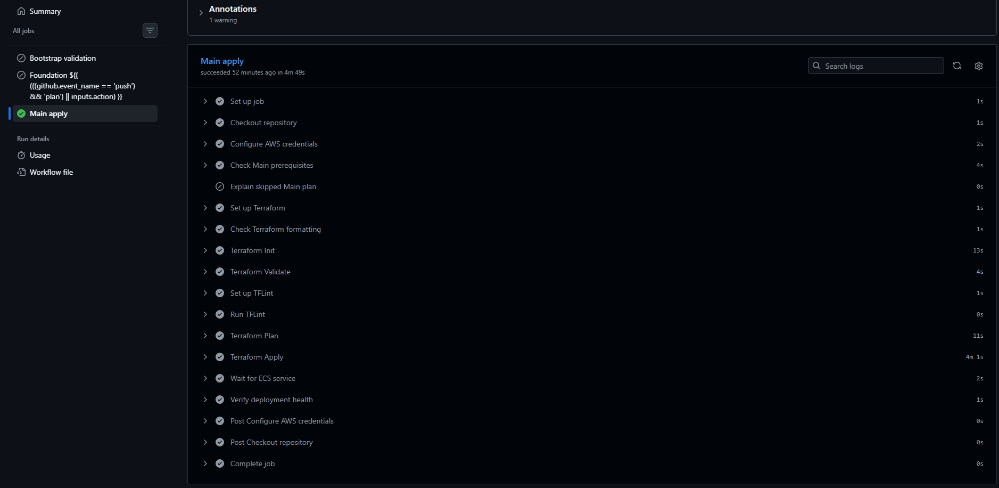
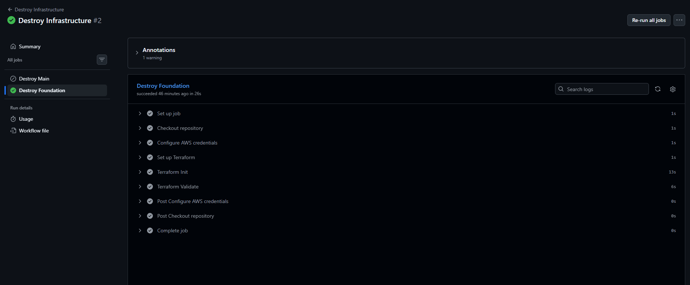
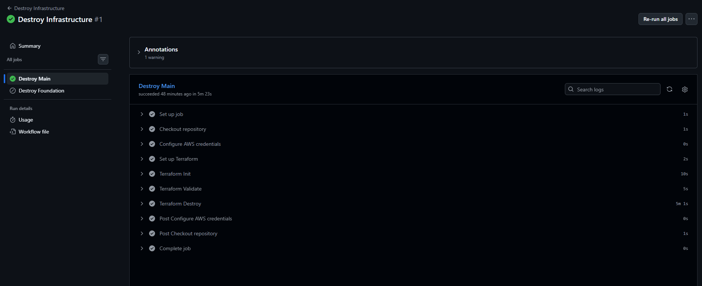

# RONIN

RONIN is a BYO small Flask application built for ECS portfolio project. It uses safe demo data to identify possible AWS infrastructure issues, underused resources and optimisation opportunities without connecting to a real customer account.

The project demonstrates how an application can be tested, containerised, deployed and removed using Docker, Terraform, AWS and GitHub Actions.

## App Demo

The deployed application is served securely at `https://ronin.humdaan.co.uk` through CloudFront, with HTTPS visible in the browser.


The interface lets a user analyse the demo environment, review findings and generate a report.

## Local Setup

### Requirements

- Docker
- Git

### Run with Docker

```bash
git clone https://github.com/rafiquehumdaan-alt/RONIN.git
cd RONIN
docker build -t ronin:local .
docker run --rm -p 8080:8080 ronin:local
```

Open [http://localhost:8080](http://localhost:8080) in a browser. Stop the application with `Ctrl+C`.

In another terminal, confirm that the required health endpoint works:

```bash
curl http://localhost:8080/health
# {"status":"ok"}
```



## Architecture

RONIN runs in AWS across two Availability Zones. Cloudflare delegates the RONIN subdomain to Route 53, and user traffic travels through CloudFront and an Application Load Balancer to ECS Fargate tasks in private subnets. ECR stores the container image, while DynamoDB, S3, Lambda and EventBridge support application data and weekly reports.

[Open the full-size architecture diagram](docs/architecture/ronin-aws-architecture-v2.png)

[](docs/architecture/ronin-aws-architecture-v2.png)

Terraform is separated into three small stages because each stage provides something required by the next:

1. **Bootstrap** uses local state to create the remote state bucket and GitHub OIDC access.
2. **Foundation** creates ECR, the Route 53 hosted zone and Cloudflare delegation.
3. **Main** creates the VPC, certificates, CloudFront, ALB, ECS, storage and reporting resources.

## CI/CD Pipelines

GitHub Actions connects to AWS through OIDC, so long-lived AWS access keys are not stored in GitHub.

- **App Deploy** builds the Docker image, starts it, checks `/health` and then pushes SHA and `latest` tags to ECR.
- **Infrastructure** checks the Terraform code and can plan or apply Foundation and Main in order.
- **Destroy Infrastructure** safely removes Main first and Foundation second after typed confirmation.

### App build and deployment



### Foundation deployment



### Main infrastructure deployment



### Main infrastructure destruction



### Foundation destruction



## Deploying from Zero

The full environment is created in this order:

1. Run `terraform init` and `terraform apply` locally in `infra/bootstrap`.
2. Run the **Infrastructure** workflow for `foundation` with the `apply` action.
3. Run the **App Deploy** workflow to build and push the image to ECR.
4. Run the **Infrastructure** workflow for `main` with the `apply` action.

To return to zero infrastructure, run the destroy workflow for **Main**, then **Foundation**, and finally run `terraform destroy` locally in `infra/bootstrap`.

## Main Technologies

Python, Flask, Docker, Terraform, AWS ECS Fargate, ECR, VPC, ALB, CloudFront, Route 53, ACM, DynamoDB, S3, Lambda, EventBridge, CloudWatch, Cloudflare and GitHub Actions.

## TIME LOG: 56 HOURS
